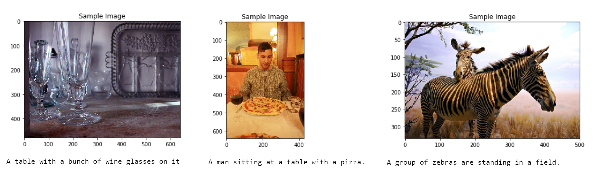
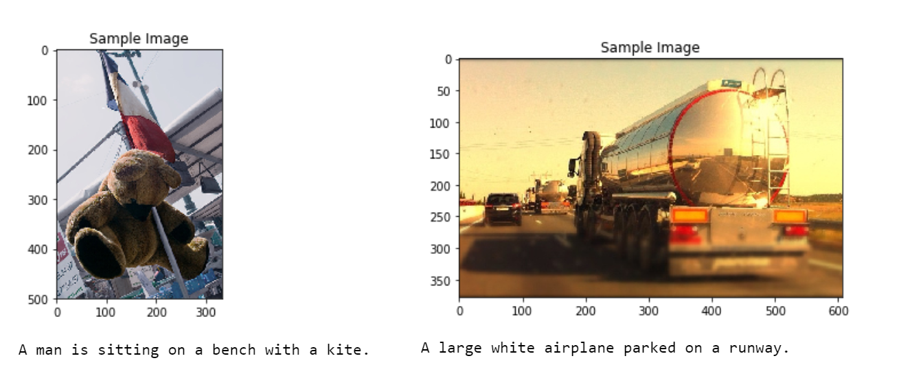

# CNN-RNN Automatic Image Captioning
 
 The objective of this project is to develop, train and test a CNN-RNN model for automatically generating captions from a given image as shown in the example image below.

### Dataset

The Microsoft **C**ommon **O**bjects in **CO**ntext (MS COCO) dataset is a large-scale dataset commonly used to train and benchmark object detection, segmentation, and captioning algorithms. This dataset of image-caption pairs (obtained using the [COCO API](https://github.com/cocodataset/cocoapi)) is used in this project to train the CNN-RNN model to automatically generate captions from images.

### Encoder

The Encoder uses the pre-trained ResNet-50 architecture (with the final fully-connected layer removed) to extract features from a batch of pre-processed images. The output is then flattened to a vector, before being passed through a Linear layer to transform the feature vector to have the same size as the word embedding.

### Decoder

The Decoder is made of an embedding layer  that stores word embedding of input feature vectors and captions, an LSTM layer and a fully-connected layer in the output that generates appropriate output key.

### CNN-RNN Encoder-Decoder

The complete model combines the pretrained ResNet50 EncoderCNN model and LSTM DecoderRNN to automatically generate image captions.

### Notebooks
The project is broken up into a few main parts in four Python notebooks:

__Notebook 0__ : Dataset - Explore the MS COCO dataset using the [COCO API](https://github.com/cocodataset/cocoapi)

__Notebook 1__ : Preliminaries - Explore the DataLoader, Obtain Batches, Experiment with the CNN Encoder and Implement the RNN Decoder

__Notebook 2__ : Training - Setup Training Process, Define & Tune Hyperparameters, Save Trained Models

__Notebook 3__ : Inference - Get Data Loader for Test Dataset, Define Decoder Sampler, Use trained model to generate captions for images in the test dataset.

## Results

The picture above samples some images in the test dataset and the corresponding (relatively accurate) predicted captions.

The picture above samples some images in the test dataset and the corresponding (relatively inaccurate) predicted captions.

## Acknowledgement

Notebook Documentation, Images and Starter Code are part of project files provided by [Udacity](https://www.udacity.com/) in the [Computer Vision Nanodegree](https://www.udacity.com/course/computer-vision-nanodegree--nd891).